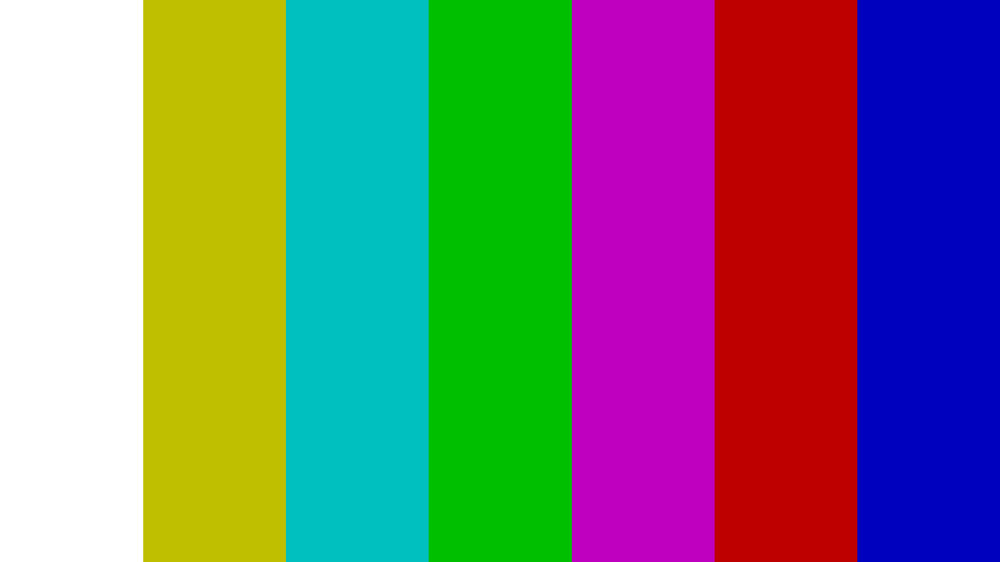

```
_________  ___  ___  ________  ________  _________   
|\___   ___\\  \|\  \|\   __  \|\   ____\|\___   ___\ 
\|___ \  \_\ \  \\\  \ \  \|\  \ \  \___|\|___ \  \_| 
     \ \  \ \ \   __  \ \   __  \ \_____  \   \ \  \  
      \ \  \ \ \  \ \  \ \  \ \  \|____|\  \   \ \  \ 
       \ \__\ \ \__\ \__\ \__\ \__\____\_\  \   \ \__\
        \|__|  \|__|\|__|\|__|\|__|\_________\   \|__|
                                  \|_________|        
                                                      
                                                    
Broadcast coordinator.
I don’t code much.
I vibe.

I make signals show up.
Always on time.
Sometimes for millions.
Sometimes for none.

---

0x00 coder
0xFF drive
AI is my IDE

---

Code works sometimes.
I work 24/7.

```

<div align="center">

<h3>D&nbsp;A&nbsp;V&nbsp;I&nbsp;D &nbsp;&nbsp; T&nbsp;H&nbsp;Å&nbsp;S&nbsp;T</h3>

<samp>Broadcast Engineer</samp>

[thåst.se](https://xn--thst-roa.se)&nbsp;&nbsp;·&nbsp;&nbsp;[thast.works](https://thast.works)

</div>

<br>

<!-- EBU/IBA 100/0/75/0 Colour Bars · ITU-R BT.1729 · BT.709 sRGB approximation · 1920×1080 -->

<p align="center">
  
</p>
